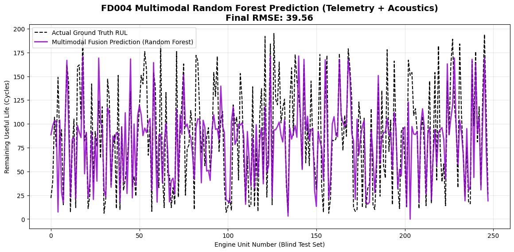
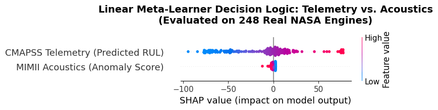

# Fusion Model Module

This module is the multimodal decision layer of the project. It combines:

- Telemetry RUL intelligence from CMAPSS-based models
- Acoustic anomaly evidence from MIMII-based models

The output is a fused prediction driven by both modalities.

## Files in This Folder

- `multimodal_fusion_layer.ipynb`
  - Builds and evaluates the multimodal fusion layer (meta-learner).
- `explainable_ai_shap.ipynb`
  - Uses SHAP to interpret the fusion model behavior.
- `linear_multimodal_fusion.pkl`
  - Saved linear fusion model artifact.
- `X_train_fusion.npy`, `X_test_fusion.npy`
  - Fusion feature matrices.
- `mimii_normal_scores.npy`, `mimii_abnormal_scores.npy`
  - Acoustic subsystem score inputs used in fusion.

## Fusion Pipeline (High Level)

1. Load acoustic anomaly score arrays.
2. Load telemetry-related specialist/router artifacts and predictions.
3. Assemble multimodal feature vectors.
4. Train the fusion meta-learner.
5. Evaluate on blind test data.
6. Save fusion model and arrays.
7. Run SHAP notebook for explainability.

## Notebook Execution Order

1. `multimodal_fusion_layer.ipynb`
2. `explainable_ai_shap.ipynb`

## Documented Fusion Outputs

The metrics below are extracted from `Documentation of PJT2 NASA.docx`.

| Model | RMSE (Test) | MAE (Test) |
|---|---:|---:|
| Telemetry-only MoE baseline | 41.51 | 32.12 |
| Multimodal fusion (Linear Meta-Learner) | **39.13** | **28.45** |

Reported gains from document:

- RMSE improvement: **2.38 cycles**
- MAE improvement: **3.67 cycles**

Reported linear fusion weights:

- Telemetry feature weight: approximately **+1.17** (baseline anchor)
- Acoustic anomaly feature weight: approximately **-21.61** (aggressive risk override)

## Graph Outputs from Notebooks

### Multimodal Fusion Prediction Plot

This notebook output corresponds to an intermediate run figure (`Final RMSE: 39.56` shown in the plot title).  
The final documented model result in the report is the linear fusion output listed above (`RMSE: 39.13`).

### SHAP Explainability Plot

The SHAP plot shows how high acoustic anomaly values contribute negative SHAP impact, reducing predicted RUL when mechanical anomaly evidence increases.

## Dependencies

- `numpy`, `pandas`, `matplotlib`
- `scikit-learn`
- `tensorflow` / `keras`
- `joblib`
- `shap`

## Integration Expectations

- Telemetry artifacts are expected from `telemetryDataset/processed_data/` and fault-specific checkpoint folders.
- Acoustic score arrays are expected from the acoustic module outputs.
- Some notebook constants use local absolute paths (`D:\\PJT2\\...`) and should be updated for your environment.

## Outcome

This module demonstrates how telemetry and acoustics can be fused into a single decision model and then interpreted with feature-attribution methods, supporting the project objective of robust multimodal predictive maintenance.
