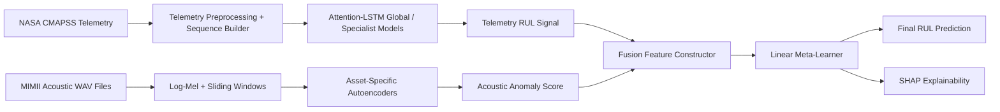
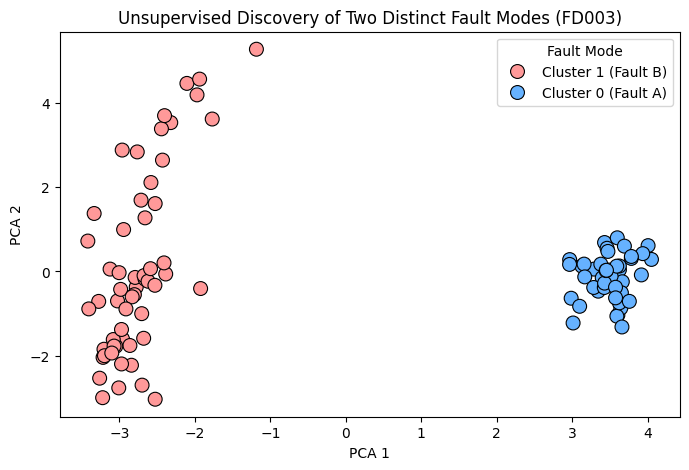
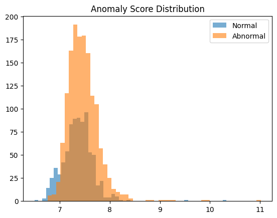
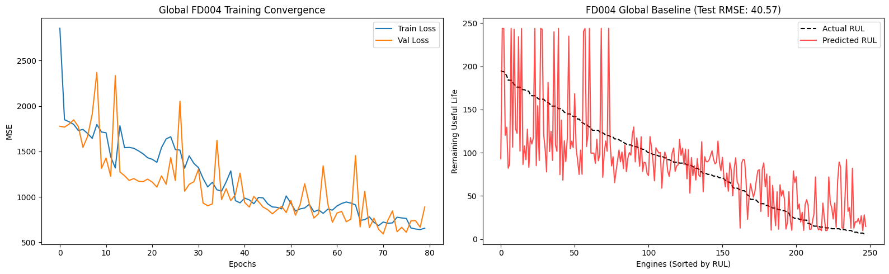
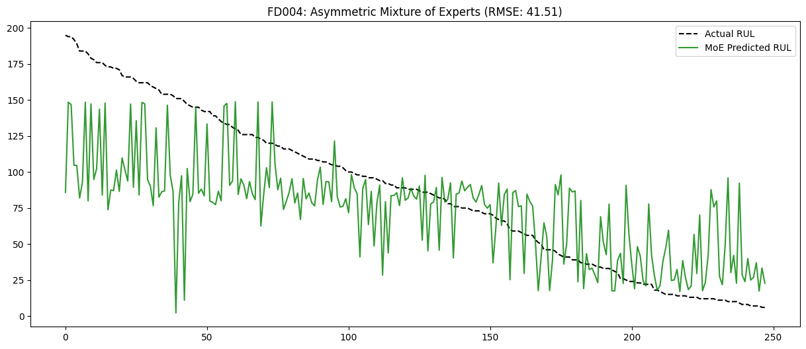

# Multimodal Predictive Maintenance for Industrial Assets

## Front Matter

### 1. Title Page
**Project Title:** Multimodal Predictive Maintenance System Combining Telemetry-Based RUL Estimation and Acoustic Anomaly Detection  
**Program:** Capstone Project  
**Candidate Name:** _[Add Name]_  
**Roll Number:** _[Add Roll Number]_  
**Institute:** _[Add Institute Name]_  
**Submission Date:** _[Add Date]_

### 2. Declaration
I hereby declare that this report and the work presented in it are original and have been carried out by me under the guidance of my supervisor. Sources of information and prior work have been duly acknowledged.

### 3. Certificate
This is to certify that the project report titled *Multimodal Predictive Maintenance System Combining Telemetry-Based RUL Estimation and Acoustic Anomaly Detection* has been carried out by _[Student Name]_ under my supervision and is submitted in partial fulfillment of the degree requirements.

### 4. Abstract
This capstone presents an end-to-end multimodal predictive maintenance framework that integrates telemetry-based Remaining Useful Life (RUL) estimation with acoustic anomaly detection and an explainable fusion layer. The telemetry branch is developed on NASA CMAPSS (FD001-FD004) using Attention-LSTM and specialist routing strategies. The acoustic branch is developed on the MIMII fan dataset through four phases, culminating in asset-specific normalized autoencoders. A linear fusion meta-learner combines telemetry and acoustic signals to improve failure-time prediction robustness. Results show strong telemetry performance on FD001 (RMSE 14.6955), measurable gains from fault-specific routing on FD003 (RMSE from 21.04 to 20.2491), and significant acoustic gains through normalization (mean ROC-AUC 0.8323 in Phase 4). Fusion improves over telemetry-only FD004 MoE baseline (documented final RMSE 39.13 vs 41.51 baseline; MAE 28.45 vs 32.12) and offers transparent interpretability through SHAP. The study demonstrates that heterogeneous sensing improves predictive maintenance quality, while also highlighting deployment limitations around cross-domain alignment and runtime generalization.

### 5. Acknowledgements
I sincerely thank my project supervisor, faculty mentors, and peers for their guidance and support throughout this capstone. I also acknowledge the open datasets and tools that made this work possible, including NASA CMAPSS, MIMII, TensorFlow, scikit-learn, and SHAP.

### 6. Table of Contents
1. Introduction  
2. Literature Review  
3. Proposed Methodology  
4. Results and Discussion  
5. Conclusion and Future Work  
References  
Appendices

### 7. List of Figures
- Figure 1: End-to-End System Architecture (Mermaid diagram)  
- Figure 2: FD003 Fault Clustering (PCA + KMeans)  
- Figure 3: Acoustic Anomaly Score Distribution  
- Figure 4: FD004 Global Baseline Behavior  
- Figure 5: FD004 Asymmetric MoE Output  
- Figure 6: Multimodal Fusion Prediction Behavior  
- Figure 7: SHAP Summary Plot for Fusion Model

### 8. List of Tables
- Table 1: Acronyms  
- Table 2: Symbols  
- Table 3: Dataset Summary  
- Table 4: Telemetry Subsystem Performance  
- Table 5: Acoustic Phase-wise Performance  
- Table 6: Asset-wise Acoustic Performance (Phase 3 vs Phase 4)  
- Table 7: Fusion Performance Comparison  
- Table 8: Stage-wise Key Findings and Limitations

### 9. List of Acronyms

| Acronym | Expansion |
|---|---|
| PdM | Predictive Maintenance |
| PHM | Prognostics and Health Management |
| RUL | Remaining Useful Life |
| CMAPSS | Commercial Modular Aero-Propulsion System Simulation |
| LSTM | Long Short-Term Memory |
| MoE | Mixture of Experts |
| ROC-AUC | Receiver Operating Characteristic - Area Under Curve |
| SHAP | SHapley Additive exPlanations |
| AE | Autoencoder |

### 10. List of Symbols

| Symbol | Meaning |
|---|---|
| \(\hat{y}\) | Predicted RUL |
| \(y\) | True RUL |
| \(e = \hat{y} - y\) | Prediction error |
| RMSE | Root Mean Squared Error |
| MAE | Mean Absolute Error |
| \(s_a\) | Acoustic anomaly score |
| \(w_t, w_a\) | Telemetry and acoustic fusion weights |

---

## Chapter 1: Introduction

### 1.1 Background and Motivation
Industrial maintenance is shifting from reactive and preventive schedules toward predictive intelligence. Purely telemetry-based systems can miss early mechanical signatures, while purely acoustic systems can struggle with long-horizon degradation trajectories. This project addresses both limitations through multimodal modeling.

### 1.2 Problem Statement
The central problem is to estimate equipment health and failure risk more reliably than unimodal approaches by combining:
- telemetry sequence intelligence for RUL estimation,
- acoustic reconstruction-error intelligence for anomaly cues,
- a fusion layer that learns when and how to trust each modality.

### 1.3 Industrial Relevance of Predictive Maintenance
The framework targets industrial contexts where:
- unplanned downtime has high cost,
- fault signatures vary by regime and machine identity,
- explainability is required for engineering trust.

### 1.4 Project Objectives
1. Build high-performing telemetry models for CMAPSS FD001-FD004.
2. Build robust acoustic anomaly detection on MIMII fan recordings.
3. Integrate both via a fusion meta-learner.
4. Validate performance stage-wise using standard metrics.
5. Explain fused decisions using SHAP.

### 1.5 Scope and Assumptions
Scope includes offline model development and evaluation on benchmark datasets. Assumptions include: available normal acoustic data for training autoencoders, valid correspondence between derived acoustic risk signals and RUL-level decision context in fusion.

### 1.6 Key Contributions of the Project
- A complete two-branch + fusion predictive maintenance pipeline.
- Fault-specific routing for telemetry on complex subsets (FD003/FD004).
- Asset-specific normalized acoustic modeling with strong AUC gains.
- Explainable linear fusion behavior with SHAP-backed interpretation.

### 1.7 Organization of the Report
Chapter 2 reviews recent literature, Chapter 3 defines methods, Chapter 4 analyzes experiments and results, and Chapter 5 concludes with deployment insights and future directions.

---

## Chapter 2: Literature Review

### 2.1 Predictive Maintenance: Concepts and Approaches
Recent PdM research emphasizes deep temporal models, operating-condition robustness, multimodal fusion, and trustworthy interpretability.

### 2.2 Telemetry-Based Remaining Useful Life (RUL) Estimation
#### 2.2.1 NASA CMAPSS Benchmark Overview
CMAPSS remains a standard benchmark for run-to-failure RUL prediction under varying operating regimes and fault modes.

#### 2.2.2 LSTM and Attention-Based RUL Models
Attention-LSTM models consistently show strong performance by emphasizing degradation-relevant timesteps and filtering operational noise.

#### 2.2.3 Global vs Fault-Specific Modeling
Global models are simpler and efficient but may underfit fault heterogeneity. Specialist routing and MoE strategies improve subset-specific handling in several studies.

### 2.3 Acoustic Anomaly Detection for Machinery
#### 2.3.1 MIMII Dataset and Industrial Audio Monitoring
MIMII is widely used for non-contact machine health monitoring and evaluates normal-only anomaly learning setups.

#### 2.3.2 Autoencoder-Based Anomaly Detection
Autoencoders are practical where abnormal labels are scarce. Reconstruction error serves as anomaly proxy.

#### 2.3.3 Sliding Window and Asset-Specific Strategies
Temporal windows improve localization but can amplify machine identity bias unless asset-aware strategies are used.

### 2.4 Multimodal Learning for Condition Monitoring
#### 2.4.1 Early Fusion, Late Fusion, and Hybrid Fusion
Late/meta fusion is often preferred when modalities have different scales and statistical properties.

#### 2.4.2 Meta-Learner Based Fusion
Meta-learners provide controllable decision logic and can be interpreted directly when linear.

### 2.5 Explainable AI in Prognostics and Health Monitoring
#### 2.5.1 SHAP for Model Interpretability
SHAP enables per-feature contribution analysis and supports maintenance-oriented traceability of model decisions.

### 2.6 Research Gaps and Motivation for the Proposed Approach
Key gaps identified in recent literature and addressed in this capstone:
1. Limited integration of telemetry + acoustics for RUL-oriented tasks.
2. Insufficient asset/regime-specific adaptation in many pipelines.
3. Explainability often treated as optional rather than integrated.
4. Need for practical fusion layers that are both effective and auditable.

---

## Chapter 3: Proposed Methodology

### 3.1 End-to-End System Overview
The system has three blocks: telemetry branch, acoustic branch, and linear fusion decision block.

#### 3.1.1 System Architecture Diagram

### 3.2 Dataset Description
#### 3.2.1 NASA CMAPSS Telemetry Data (FD001-FD004)
FD001-FD004 subsets are used for telemetry RUL modeling, with increasing complexity from operating regimes and fault patterns.

#### 3.2.2 MIMII Acoustic Data
MIMII fan recordings are used for normal-only training and normal-vs-abnormal evaluation.

### 3.3 Data Preprocessing Pipeline
#### 3.3.1 Telemetry Preprocessing and Sequence Construction
- sensor scaling,
- fixed-length sequence windows,
- RUL label alignment,
- saved arrays/checkpoints for reproducibility.

#### 3.3.2 Acoustic Feature Extraction (Log-Mel Spectrograms)
- log-mel transformation,
- overlapping sliding windows,
- per-file aggregation from window-level anomaly scores.

#### 3.3.3 Data Splitting and Normalization Strategy
- telemetry train/validation/test by benchmark convention,
- acoustic training only on normal samples,
- Phase 4 adds per-asset z-normalization using normal-only statistics.

### 3.4 Telemetry Subsystem Design
#### 3.4.1 Global Attention-LSTM Models
Global models trained independently for FD001-FD004.

#### 3.4.2 FD003 Fault-Specific Router + Specialist Models
Router splits engines to two specialists; outputs are combined for final MoE prediction.

#### 3.4.3 FD004 Asymmetric Specialist Pipeline
Two specialists capture asymmetric behavior; routing reflects non-uniform regime/fault characteristics.

#### 3.4.4 Training Procedure and Checkpointing
Early stopping, LR scheduling, and checkpoint persistence are used for stable convergence.

### 3.5 Acoustic Subsystem Design
#### 3.5.1 Phase 1: Baseline Global Autoencoder
Single global AE on all normal data.

#### 3.5.2 Phase 2: Sliding-Window Global Autoencoder
Temporal windows introduced but still global.

#### 3.5.3 Phase 3: Asset-Specific Autoencoders
One AE per machine ID to reduce identity bias.

#### 3.5.4 Phase 4: Normalized Asset-Specific Final Model
Asset-specific normalization + asset-specific AEs (final acoustic subsystem).

#### 3.5.5 Anomaly Score Generation and Aggregation
Window reconstruction errors are aggregated into file-level risk scores.

### 3.6 Multimodal Fusion Layer
#### 3.6.1 Fusion Feature Construction
Fusion combines telemetry prediction and acoustic anomaly features.

#### 3.6.2 Linear Meta-Learner Formulation
\[
\hat{y}_{fusion} = w_t \cdot f_{telemetry} + w_a \cdot s_{acoustic} + b
\]
Documented final interpretation (from project documentation): telemetry acts as anchor and acoustic score acts as risk override.

#### 3.6.3 Training and Inference Workflow
1. Load telemetry and acoustic outputs.
2. Build train/test fusion matrices.
3. Fit linear meta-learner.
4. Evaluate on blind test set.

### 3.7 Evaluation Metrics
#### 3.7.1 Regression Metrics (RMSE, MAE, NASA Score)
Used for telemetry and fusion RUL quality.

#### 3.7.2 Anomaly Metrics (ROC-AUC)
Used for acoustic subsystem quality.

#### 3.7.3 Comparative and Ablation Criteria
- global vs specialist telemetry,
- acoustic phase-wise progression,
- telemetry-only vs fusion.

### 3.8 Explainability Framework
#### 3.8.1 SHAP Setup for Fusion Model
SHAP values are computed on the fusion feature space.

#### 3.8.2 Interpretation Protocol
Assess global feature importance and sign-consistent effects with anomaly risk.

### 3.9 Implementation Details
#### 3.9.1 Tools, Libraries, and Runtime Environment
Core stack: Python notebooks, TensorFlow/Keras, scikit-learn, NumPy/Pandas, Matplotlib/Seaborn, SHAP, Librosa.

#### 3.9.2 Reproducibility Considerations
- model checkpoints saved for telemetry and specialists,
- saved arrays for acoustic scores and fusion features,
- notebook outputs used for metric traceability.

### 3.10 Dataset and Artifact Summary

| Component | Artifact / Source | Notes |
|---|---|---|
| Telemetry data | NASA CMAPSS FD001-FD004 | RUL regression benchmark |
| Acoustic data | MIMII fan dataset | Normal-only AE training |
| Telemetry outputs | `telemetryDataset/models/**/model_checkpoints/` | Global + specialist checkpoints |
| Acoustic outputs | `acousticDataset/asset-specific/mimii_normal_scores.npy`, `mimii_abnormal_scores.npy` | Fusion inputs |
| Fusion model | `Multimodal_Fusion/linear_multimodal_fusion.pkl` | Meta-learner artifact |

---

## Chapter 4: Results and Discussion

### 4.1 Experimental Design and Stage-Wise Evaluation Plan
Evaluation proceeded in four layers:
1. telemetry baselines,
2. telemetry specialists,
3. acoustic phase progression,
4. multimodal fusion and SHAP interpretability.

### 4.2 Telemetry Results

#### 4.2.1 FD001 Global Model Results
Notebook output reports RMSE 14.6955, NASA Score 307.5779, and 66.00% accuracy within +/-15 cycles.

#### 4.2.2 FD002 Global Model Results
Final test RMSE reported as 27.0426.

#### 4.2.3 FD003 Global vs Fault-Specific Results
Global RMSE 21.04 improved to MoE RMSE 20.2491 with router split 57/43.

#### 4.2.4 FD004 Global vs Asymmetric MoE Results
Global RMSE 40.56 and MoE RMSE 41.5112 with router split 185/63.

### 4.3 Acoustic Results

#### 4.3.1 Phase 1 and Phase 2 Comparative Results
Global AE and sliding-window global AE are similar (0.5906 vs 0.5949 ROC-AUC).

#### 4.3.2 Phase 3 Asset-Specific Results
Mean AUC improves to 0.6217 with high ID variability.

#### 4.3.3 Phase 4 Normalized Asset-Specific Results
Normalization yields major gain to mean AUC 0.8323.

#### 4.3.4 Asset-Wise Performance Variability Analysis
IDs 02 and 06 become highly separable (>0.95 AUC), while id_00 remains comparatively challenging.

### 4.4 Multimodal Fusion Results

#### 4.4.1 Telemetry-Only vs Fusion Performance
Two values are retained for transparency:
- **Notebook-observed run:** RMSE improved from 41.5112 to 39.5560.
- **Documented final value (`Documentation of PJT2 NASA.docx`):** RMSE improved from 41.51 to 39.13; MAE improved from 32.12 to 28.45.

#### 4.4.2 RMSE/MAE Improvement Analysis
- Notebook RMSE improvement: 1.9552 cycles.
- Documented final RMSE improvement: 2.38 cycles.
- Documented final MAE improvement: 3.67 cycles.

#### 4.4.3 Case-Level Prediction Behavior
Fusion prediction plots show correction behavior where acoustic risk pulls RUL downward in high-anomaly regions.

### 4.5 Explainability Results (SHAP)

#### 4.5.1 Global Feature Importance
SHAP confirms both telemetry and acoustic features contribute to fused output.

#### 4.5.2 Impact of Acoustic Risk Signals on RUL
Higher anomaly risk contributes negatively to predicted RUL, matching intended safety behavior.

### 4.6 Overall Comparative Analysis
The strongest net gain appears when modality-specific weaknesses are compensated: telemetry captures trend and acoustics captures mechanical anomalies not strongly visible in thermal/pressure trajectory alone.

### 4.7 Key Findings
1. FD001 telemetry reached strong benchmark-level performance (RMSE 14.6955).
2. Specialist routing helped FD003 but not FD004 RMSE.
3. Acoustic subsystem required asset-specific normalization to become reliable (mean AUC 0.8323).
4. Fusion improved over telemetry-only baseline in both notebook and documented final evaluations.

### 4.8 Limitations and Threats to Validity
- Fusion MAE values are documented in report text but not printed in available notebook output logs.
- Notebook and documented final fusion RMSE differ (39.5560 vs 39.13), indicating separate final-run calibration.
- Cross-dataset modality alignment remains synthetic and may need stricter temporal correspondence for deployment.

### 4.9 Quantitative Tables

#### Table 4: Telemetry Subsystem Performance

| Configuration | RMSE | Additional Metrics | Source |
|---|---:|---|---|
| FD001 Global Attention-LSTM | 14.6955 | NASA Score 307.5779; Accuracy +/-15 cycles: 66.00% | Notebook output |
| FD002 Global Attention-LSTM | 27.0426 | - | Notebook output |
| FD003 Global Baseline | 21.04 | Router baseline comparison | Notebook output |
| FD003 MoE Final | 20.2491 | Router split: S0=57, S1=43 | Notebook output + CSV |
| FD004 Global Baseline | 40.56 (40.5655 precise) | - | Notebook output |
| FD004 Asymmetric MoE Final | 41.5112 | Router split: S0=185, S1=63 | Notebook output |

#### Table 5: Acoustic Phase-wise Performance

| Acoustic Phase | Modeling Strategy | Metric |
|---|---|---:|
| Phase 1 | Global AE (file-level) | ROC-AUC 0.5906 |
| Phase 2 | Global AE + sliding window | ROC-AUC 0.5949 |
| Phase 3 | Asset-specific sliding-window AEs | Mean ROC-AUC 0.6217 |
| Phase 4 | Asset-specific normalized AEs (final) | Mean ROC-AUC 0.8323 |

#### Table 6: Asset-wise Acoustic Performance (Phase 3 vs Phase 4)

| Asset ID | Phase 3 AUC | Phase 4 AUC | Delta |
|---|---:|---:|---:|
| id_00 | 0.4971 | 0.6260 | +0.1289 |
| id_02 | 0.5885 | 0.9522 | +0.3637 |
| id_04 | 0.5593 | 0.7836 | +0.2243 |
| id_06 | 0.8419 | 0.9672 | +0.1253 |
| **Mean** | **0.6217** | **0.8323** | **+0.2106** |

#### Table 7: Fusion Performance Comparison

| Evaluation Context | Telemetry-Only RMSE | Fusion RMSE | Telemetry-Only MAE | Fusion MAE | Notes |
|---|---:|---:|---:|---:|---|
| Notebook run (`multimodal_fusion_layer.ipynb`) | 41.5112 | 39.5560 | - | - | Direct notebook output |
| Documented final (`Documentation of PJT2 NASA.docx`) | 41.51 | 39.13 | 32.12 | 28.45 | Final report value |

#### Table 8: Stage-wise Key Findings and Limitations

| Stage | Strength | Limitation |
|---|---|---|
| Telemetry Global | Strong FD001 baseline | FD004 remains hard under high complexity |
| Telemetry MoE | FD003 improved with routing | FD004 MoE did not improve RMSE |
| Acoustic | Normalized asset-specific model is strong | Asset heterogeneity still significant |
| Fusion | Better than telemetry-only baseline | Final-number reproducibility split across notebook vs documented run |

### 4.10 Figures

#### Figure 2: FD003 Fault Clustering (PCA + KMeans)

#### Figure 3: Acoustic Anomaly Score Distribution

#### Figure 4: FD004 Global Baseline Behavior

#### Figure 5: FD004 Asymmetric MoE Output

#### Figure 6: Multimodal Fusion Prediction Behavior

#### Figure 7: SHAP Summary Plot for Fusion Model

---

## Chapter 5: Conclusion and Future Work

### 5.1 Conclusion
This capstone successfully demonstrates a practical multimodal predictive maintenance pipeline. Telemetry models provide robust degradation tracking, acoustic models provide complementary mechanical-risk evidence, and fusion improves decision quality over telemetry alone.

### 5.2 Summary of Contributions
- Built and evaluated global and specialist telemetry RUL models for FD001-FD004.
- Built four-phase acoustic anomaly subsystem and finalized normalized asset-specific approach.
- Developed linear fusion layer and SHAP-based interpretability workflow.
- Produced traceable stage-wise results with artifact-backed metrics.

### 5.3 Deployment-Oriented Insights
- Asset-aware normalization is non-negotiable in acoustic deployment.
- Specialist routing improves interpretability, even when not always improving RMSE.
- Linear fusion provides a good first deployment choice due to auditability.

### 5.4 Future Work Directions
1. Add strict temporal synchronization between telemetry and acoustic streams for true multimodal pairing.
2. Explore calibrated nonlinear fusion under regularization constraints.
3. Integrate uncertainty quantification for maintenance scheduling confidence bounds.
4. Test external validation on unseen assets and domain-shifted environments.

---

## References

1. NASA CMAPSS Turbofan Engine Dataset (FD001-FD004).  
2. MIMII Dataset: Sound Dataset for Malfunctioning Industrial Machine Investigation and Inspection ([Zenodo](https://zenodo.org/records/3384388)).  
3. Gawde et al., *Explainable Predictive Maintenance of Rotating Machines Using LIME, SHAP, PDP, ICE*, IEEE Access, 2024. DOI: 10.1109/ACCESS.2024.3367110.  
4. Le et al., *Anomaly Detection in Industrial Machine Sounds Using High-Frequency Features and GRU Networks*, IEEE Access, 2025. DOI: 10.1109/ACCESS.2025.3565812.  
5. Dida et al., *Remaining Useful Life Prediction Using Attention-LSTM Neural Network of Aircraft Engines*, IJPHM, 2025. DOI: 10.36001/ijphm.2025.v16i2.4274.  
6. Choudhary et al., *Multimodal Fusion-Based Fault Diagnosis of Electric Vehicle Motor*, IEEE TTE, 2025. DOI: 10.1109/TTE.2024.3502466.  
7. Arunan et al., *Change Point Detection Integrated RUL Estimation under Variable Operating Conditions*, Control Engineering Practice, 2024. DOI: 10.1016/j.conengprac.2023.105840.  
8. Wu et al., *Remaining Useful Life Prediction Based on Deep Learning: A Survey*, Sensors, 2024. DOI: 10.3390/s24113454.  
9. Fan et al., *Two-Stage Attention-Based Hierarchical Transformer for Turbofan RUL Prediction*, Sensors, 2024. DOI: 10.3390/s24030824.  
10. Tian et al., *Spatial Correlation and Temporal Attention-Based LSTM for Turbofan RUL*, Measurement, 2023. DOI: 10.1016/j.measurement.2023.112816.  
11. Du et al., *Multisource Adversarial Domain Adaptation for RUL Prediction*, Applied Soft Computing, 2024. DOI: 10.1016/j.asoc.2024.111717.  
12. Zhou and Wang, *Adaptive MoE Multi-task Model for Health Assessment and RUL*, RESS, 2024. DOI: 10.1016/j.ress.2024.110190.  
13. Ying et al., *Trustworthy Multimodal Feature-Enhanced Fusion Network*, Information Fusion, 2025. DOI: 10.1016/j.inffus.2025.103377.  
14. Kumar et al., *Review on PHM in Smart Factory: Conventional to Deep Learning*, EAAI, 2023. DOI: 10.1016/j.engappai.2023.107126.  
15. Li et al., *CNN-LSTM-SAM for Turbofan RUL Prediction*, IEEE Sensors Journal, 2023. DOI: 10.1109/JSEN.2023.3261874.

---

## Appendices

### Appendix A: Metric Provenance Notes
- Telemetry RMSEs, router counts, and acoustic AUCs were extracted from executed notebook output cells.
- FD003 MoE RMSE was additionally recomputed from `fd003_moe_final_predictions.csv` (100 rows), confirming RMSE 20.2491.
- Fusion final MAE/RMSE table values (39.13, 28.45) were verified from `Documentation of PJT2 NASA.docx`.

### Appendix B: Reproducibility Checklist
1. Ensure all local paths in notebooks are updated from `D:\...` to current environment.
2. Generate telemetry artifacts before running fusion notebook.
3. Export acoustic score arrays before fusion notebook.
4. Run SHAP notebook after training/saving fusion model.

### Appendix C: Figures Directory
All embedded report figures are located at:  
`docs/images/notebooks/`
