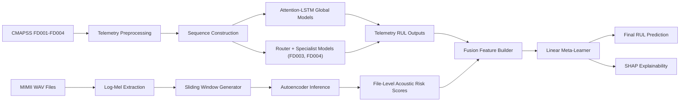

# Chapter 3: Proposed Methodology

## 3.1 Methodology Overview
This chapter describes the complete technical pipeline used in the capstone, from data preparation to subsystem modeling, fusion, and explainability. The methodology is intentionally structured as a staged engineering system so each component can be independently validated and then integrated.

The full system has three major layers:
1. **Telemetry Prognostics Layer** (CMAPSS): sequence-based RUL estimation.
2. **Acoustic Monitoring Layer** (MIMII): reconstruction-error anomaly scoring.
3. **Multimodal Fusion + Explainability Layer**: final decision synthesis and SHAP interpretation.

A stage-wise methodology was selected for three reasons:
- isolate modality-specific weaknesses before integration,
- preserve reproducibility through saved intermediate artifacts,
- make fusion behavior auditable rather than opaque.

## 3.2 End-to-End System Architecture

### 3.2.1 Architectural Flow


### 3.2.2 Design Rationale
The architecture separates modality-specific modeling from cross-modality decision synthesis. This enables:
- specialized preprocessing and normalization per modality,
- independent subsystem benchmarking,
- late-fusion flexibility without retraining base models.

## 3.3 Dataset Description

### 3.3.1 NASA CMAPSS Telemetry (FD001-FD004)
The telemetry branch uses CMAPSS subsets FD001-FD004. Each subset provides engine run-to-failure trajectories under different regime/fault complexities.

- **FD001**: lower complexity baseline.
- **FD002**: increased operating condition variability.
- **FD003**: added fault complexity with useful clustering structure.
- **FD004**: highest difficulty with mixed regimes and faults.

Target variable is Remaining Useful Life (RUL), learned as a regression problem from multivariate sensor sequences.

### 3.3.2 MIMII Acoustic Dataset
The acoustic branch uses MIMII fan recordings.

Key setup assumptions:
- train autoencoders on normal behavior only,
- evaluate discrimination between normal and abnormal files,
- use reconstruction error as anomaly score.

### 3.3.3 Multimodal Coupling Assumption
The fusion layer treats telemetry and acoustic outputs as complementary health evidence. Even though raw sources are heterogeneous, decision-level fusion remains valid if both signals correlate with latent degradation risk.

## 3.4 Telemetry Data Preprocessing

### 3.4.1 Ingestion and Feature Handling
Each CMAPSS subset is processed independently to avoid leakage between distributions.

Processing operations:
1. load trajectory tables,
2. remove or retain sensors based on variance/usefulness,
3. standardize numerical features,
4. align cycle indices and target labels.

### 3.4.2 RUL Target Construction
For each engine trajectory, RUL at cycle \(t\) is typically derived from failure horizon:

\[
RUL_t = T_{failure} - t
\]

where \(T_{failure}\) is the last cycle for that engine in training runs.

Optional capping strategies can be used to stabilize early-cycle labels (project notebooks primarily follow benchmark-aligned labeling behavior).

### 3.4.3 Sequence Windowing
The telemetry model consumes fixed-length windows:

\[
X_i \in \mathbb{R}^{L \times d}
\]

where:
- \(L\): sequence length,
- \(d\): number of selected sensors/features,
- \(i\): sample index.

Target \(y_i\) is aligned to the terminal step (or configured alignment) of each window.

### 3.4.4 Train/Validation/Test Persistence
To ensure reproducibility and subsystem decoupling, processed tensors and scalers are persisted as arrays/objects. This also simplifies specialist routing workflows and later fusion feature construction.

## 3.5 Telemetry Subsystem Modeling

## 3.5.1 Global Attention-LSTM Formulation
Each global model learns a mapping:

\[
f_{tele}(X_i) = \hat{y}_i
\]

A representative sequence architecture consists of:
- LSTM encoders for temporal dynamics,
- attention block for timestep weighting,
- dense regression head for scalar RUL output.

### 3.5.2 Attention Mechanism
Given hidden states \(h_t\), attention weights \(\alpha_t\) are computed as:

\[
\alpha_t = \frac{\exp(e_t)}{\sum_{k=1}^{L}\exp(e_k)}, \quad e_t = g(h_t)
\]

Context vector:

\[
c = \sum_{t=1}^{L}\alpha_t h_t
\]

Final regression uses \(c\) (or concatenated representations) as input to dense layers.

### 3.5.3 Optimization Objective
Training minimizes regression loss, typically MSE:

\[
\mathcal{L}_{MSE} = \frac{1}{N}\sum_{i=1}^{N}(y_i - \hat{y}_i)^2
\]

with Adam-based optimization, LR scheduling, and checkpointing.

### 3.5.4 Why Attention-LSTM Was Chosen
- robust temporal inductive bias,
- practical notebook-level training stability,
- strong benchmark precedents for CMAPSS.

## 3.6 Fault-Specific Telemetry Routing

### 3.6.1 FD003 Router + Specialists
FD003 includes separable structure that enables specialist modeling.

Pipeline:
1. derive clustering/router features,
2. train router to assign each sample to specialist 0 or 1,
3. train specialist regressors on routed partitions,
4. perform routed inference and merge predictions.

Routed prediction:

\[
\hat{y}_i = \hat{y}_i^{(r_i)}, \quad r_i \in \{0,1\}
\]

where \(r_i\) is the router-selected specialist.

### 3.6.2 FD004 Asymmetric Specialists
FD004 routing uses an asymmetric split due to complex regime interactions. Specialists do not receive equal volume or identical behavior distributions.

This design is diagnostically useful even when raw RMSE gains are not guaranteed.

### 3.6.3 Engineering Tradeoff
Specialists increase training/inference complexity and can be sensitive to routing quality, but improve model interpretability and localized modeling capacity.

## 3.7 Acoustic Data Preprocessing

### 3.7.1 Audio to Log-Mel Representation
Each waveform is transformed into log-mel spectrogram space:

\[
S_{logmel} = \log(\text{MelSpectrogram}(x) + \epsilon)
\]

where \(x\) is audio signal and \(\epsilon\) avoids log singularity.

### 3.7.2 Sliding Window Construction
Spectrogram sequences are partitioned into overlapping windows to capture transient anomalies:

\[
W_j = S[:, t_j:t_j+w]
\]

where \(w\) is window width and \(t_j\) window start index.

### 3.7.3 Normalization Strategy
Phase 4 applies per-asset z-normalization:

\[
\tilde{W} = \frac{W - \mu_{asset}}{\sigma_{asset} + \delta}
\]

with \(\mu_{asset}, \sigma_{asset}\) estimated from normal training windows only.

## 3.8 Acoustic Subsystem Modeling

### 3.8.1 Autoencoder Objective
For input window \(W\), autoencoder reconstructs \(\hat{W}\):

\[
\hat{W} = AE(W)
\]

Reconstruction error (window-level anomaly score):

\[
a(W) = \frac{1}{|W|}\|W - \hat{W}\|_2^2
\]

### 3.8.2 File-Level Aggregation
Given window scores \(a_1, a_2, \dots, a_m\), file-level anomaly score \(s_a\) is aggregated (max/mean depending on phase configuration):

\[
s_a = \max_j a_j \quad \text{(used in robust anomaly emphasis settings)}
\]

### 3.8.3 Phase-Wise Development Logic
- **Phase 1**: global AE baseline.
- **Phase 2**: global AE with sliding windows.
- **Phase 3**: asset-specific AEs with sliding windows.
- **Phase 4**: asset-specific + normalization (final).

This staged approach isolates which intervention contributes actual gain.

## 3.9 Multimodal Fusion Layer

### 3.9.1 Fusion Feature Vector
For each sample \(i\), fusion feature vector is:

\[
z_i = [f_{tele,i},\ s_{a,i}]^\top
\]

where:
- \(f_{tele,i}\): telemetry-based RUL estimate or proxy,
- \(s_{a,i}\): acoustic anomaly score.

### 3.9.2 Linear Meta-Learner
Final fused prediction:

\[
\hat{y}_{i}^{fusion} = w_t f_{tele,i} + w_a s_{a,i} + b
\]

Linear design was selected for:
- transparent coefficient interpretation,
- reduced overfitting risk under limited aligned fusion data,
- direct SHAP compatibility and clear sign analysis.

### 3.9.3 Training Workflow
1. load telemetry and acoustic outputs,
2. construct aligned train/test fusion matrices,
3. fit linear regression model,
4. evaluate against telemetry-only baseline,
5. save model and fusion arrays for reproducibility.

### 3.9.4 Interpretation Semantics
In documented final project interpretation:
- telemetry weight behaves as baseline anchor,
- acoustic weight behaves as risk override (higher anomaly risk reduces predicted life).

## 3.10 Explainability Framework (SHAP)

### 3.10.1 SHAP Setup
Given trained fusion model \(f\) and input \(z_i\), SHAP decomposes prediction as:

\[
f(z_i) = \phi_0 + \sum_{k=1}^{K}\phi_k
\]

where:
- \(\phi_0\): expected model output,
- \(\phi_k\): contribution of feature \(k\),
- \(K=2\) for the fusion feature space.

### 3.10.2 Interpretation Protocol
- verify global ranking of fusion features,
- check sign-consistency of acoustic risk impact,
- compare interpretation with expected maintenance logic.

## 3.11 Evaluation Methodology and Formulas

### 3.11.1 RMSE
\[
RMSE = \sqrt{\frac{1}{N}\sum_{i=1}^{N}(\hat{y}_i - y_i)^2}
\]

### 3.11.2 MAE
\[
MAE = \frac{1}{N}\sum_{i=1}^{N}|\hat{y}_i - y_i|
\]

### 3.11.3 NASA Score (CMAPSS)
Define error \(d_i = \hat{y}_i - y_i\). Per-sample score:

\[
s_i =
\begin{cases}
\exp\left(-\frac{d_i}{13}\right)-1, & d_i < 0 \\
\exp\left(\frac{d_i}{10}\right)-1, & d_i \ge 0
\end{cases}
\]

Total NASA score:
\[
S_{NASA} = \sum_{i=1}^{N} s_i
\]

Late predictions are penalized more heavily than early predictions.

### 3.11.4 ROC-AUC for Anomaly Detection
ROC curve is generated by sweeping threshold \(\tau\) over anomaly score. Let:

\[
TPR(\tau) = \frac{TP}{TP+FN}, \quad FPR(\tau)=\frac{FP}{FP+TN}
\]

AUC is:
\[
AUC = \int_0^1 TPR(FPR)\,d(FPR)
\]

Higher AUC indicates better normal-abnormal separability.

### 3.11.5 Comparative Criteria
Primary comparisons include:
- global vs specialist telemetry,
- acoustic phase progression,
- telemetry-only vs fusion.

## 3.12 Experimental Control and Reproducibility

### 3.12.1 Artifact Persistence
The pipeline stores:
- processed arrays (train/test splits, feature matrices),
- model checkpoints (global and specialists),
- fusion features (`X_train_fusion.npy`, `X_test_fusion.npy`),
- final linear fusion model (`linear_multimodal_fusion.pkl`).

### 3.12.2 Stage Isolation
Each stage can be rerun independently:
- telemetry notebooks first,
- acoustic notebooks next,
- fusion notebook after both outputs are ready,
- SHAP notebook after fusion training.

### 3.12.3 Path and Environment Notes
Several notebooks originally use local absolute paths. For reproducible reruns, all paths should be normalized to workspace-relative directories.

## 3.13 Implementation Stack

| Layer | Core Tools |
|---|---|
| Telemetry modeling | TensorFlow/Keras, NumPy, scikit-learn |
| Acoustic processing | Librosa, NumPy, TensorFlow/Keras |
| Fusion layer | scikit-learn linear regression, NumPy |
| Explainability | SHAP, Matplotlib |
| Analysis/plots | Pandas, Matplotlib, Seaborn |

## 3.14 Computational Workflow Summary

| Stage | Input | Output |
|---|---|---|
| Telemetry preprocessing | Raw CMAPSS files | Sequence tensors + scalers |
| Telemetry training | Sequence tensors | Global/specialist predictions |
| Acoustic preprocessing | Raw WAV files | Log-mel windows |
| Acoustic training/inference | Windows | File-level anomaly scores |
| Fusion construction | Telemetry + acoustic outputs | Fusion feature matrices |
| Fusion training | Feature matrices | Final fused predictor |
| SHAP analysis | Fused predictor + test features | Feature attribution plots |

## 3.15 Subsystem Visuals

### 3.15.1 Acoustic Distribution Snapshot


### 3.15.2 Telemetry FD004 Global Behavior


### 3.15.3 FD004 Asymmetric MoE Output


## 3.16 Methodological Risks and Mitigations

| Risk | Impact | Mitigation Used |
|---|---|---|
| Regime/fault heterogeneity in telemetry | Global underfitting | Specialist routing experiments |
| Asset identity confounding in acoustics | Poor anomaly separability | Asset-specific modeling + normalization |
| Modality scale mismatch in fusion | Unstable integration | Simple linear late fusion |
| Opaque decisions | Low engineer trust | SHAP-based attribution |
| Notebook drift across runs | Metric inconsistency | Artifact-backed stage outputs |

## 3.17 Why This Methodology is Fit for Purpose
The methodology is fit for the project objective because it is:
- **modular**: each layer can be improved without rewriting the whole system,
- **traceable**: metrics are linked to stage artifacts,
- **interpretable**: final decisions can be explained in feature terms,
- **realistic**: it reflects practical constraints of heterogeneous industrial sensing.

Rather than assuming one architecture solves everything, the project uses a layered strategy that acknowledges modality differences and integrates them where they are most semantically compatible.

## 3.18 Chapter Summary
This chapter provided a complete technical specification of the proposed multimodal predictive maintenance system. It covered dataset handling, telemetry and acoustic subsystem design, fusion mathematics, evaluation formulas, explainability setup, and reproducibility controls. The next chapter applies this methodology and reports stage-wise results, comparisons, and critical analysis.

## 3.19 Detailed Telemetry Training Protocol

### 3.19.1 Data Splits and Sequence Integrity
For each FD subset, training, validation, and test partitions are handled to prevent engine identity leakage across partitions. Sequence windows are generated within engine trajectories only, preserving temporal continuity and preventing boundary artifacts.

### 3.19.2 Batch Construction and Shuffling
Training batches are shuffled at sample level while preserving precomputed sequence windows. No cross-window temporal stitching is performed during training. This ensures model learns from local temporal contexts without synthetic continuity assumptions.

### 3.19.3 Early Stopping and Learning-Rate Scheduling
A staged optimizer protocol is used:
- start with baseline learning rate (Adam),
- monitor validation loss and MAE,
- reduce LR on plateau,
- checkpoint best model state.

This reduces overfitting risk and improves convergence stability across long training schedules.

### 3.19.4 Checkpoint Policy
Checkpointing is not only for fault tolerance. It is also used to maintain traceable model lineage by subset and specialist identity.

Checkpoint naming strategy includes:
- dataset identifier (`FD001`, `FD002`, ...),
- model role (`global`, `specialist_0`, `specialist_1`),
- file extension indicating framework serialization.

## 3.20 Router and Specialist Inference Logic

### 3.20.1 FD003 Routing Pipeline
During inference:
1. compute router feature signature,
2. assign cluster label,
3. forward sample to specialist model,
4. merge outputs in original sample order.

Pseudo-workflow:

```text
for sample i in test_set:
    r_i = router(signature_i)
    yhat_i = specialist[r_i](x_i)
return yhat
```

### 3.20.2 FD004 Asymmetric Routing Considerations
FD004 routing introduces strong class imbalance at specialist assignment level. This has implications:
- specialist calibration can diverge,
- minority specialist may overfit or under-generalize,
- final RMSE may not improve even if local behavior interpretation improves.

### 3.20.3 Specialist-Oriented Diagnostics
Recommended diagnostics for routed models:
- per-specialist validation error,
- routed sample count distribution,
- calibration drift between specialists,
- router confidence histogram.

## 3.21 Detailed Acoustic Pipeline Mechanics

### 3.21.1 Signal Preprocessing
Acoustic inputs are standardized through consistent sample-rate handling and spectrogram parameterization to keep feature geometry stable across phases.

### 3.21.2 Window Overlap Policy
Overlapping windows are used to avoid missing short-duration anomalies at segment boundaries. Overlap ratio is selected as a tradeoff between:
- sensitivity to transient events,
- computational overhead,
- score redundancy.

### 3.21.3 Reconstruction Error Distribution Handling
Raw reconstruction errors can be heavy-tailed. Practical mitigation options include:
- robust aggregators (max/percentile),
- per-asset scaling,
- threshold calibration on validation distributions.

### 3.21.4 Asset-Specific Normalization Details
For each asset ID:
1. gather normal training windows,
2. compute \(\mu_{asset}\), \(\sigma_{asset}\),
3. normalize train/inference windows with same statistics.

This enforces consistency and avoids leakage from abnormal distributions into normalization estimates.

## 3.22 Fusion Data Engineering

### 3.22.1 Feature Alignment
Fusion requires strict sample-level alignment between telemetry-derived and acoustic-derived features. Any mismatch creates label/feature inconsistency and invalid evaluation.

### 3.22.2 Scaling and Coefficient Interpretability
Linear fusion is sensitive to feature scale. To preserve coefficient meaning, features are prepared with consistent scaling logic before model fitting.

### 3.22.3 Train/Test Integrity in Fusion Stage
Fusion model is trained only on designated training fusion matrix and evaluated on blind test matrix. Reusing test-derived transformations in training is explicitly avoided.

## 3.23 Mathematical Addendum: Error Decomposition
Given fused prediction error:

\[
\epsilon_i^{fusion} = y_i - \hat{y}_i^{fusion}
\]

and telemetry baseline error:

\[
\epsilon_i^{tele} = y_i - \hat{y}_i^{tele}
\]

fusion improvement can be analyzed via:

\[
\Delta_i = |\epsilon_i^{tele}| - |\epsilon_i^{fusion}|
\]

Positive \(\Delta_i\) means sample-level improvement over telemetry baseline.

Dataset-level mean absolute gain:

\[
\bar{\Delta} = \frac{1}{N}\sum_{i=1}^{N}\Delta_i
\]

This can complement aggregate RMSE differences for case-level diagnostics.

## 3.24 Evaluation Pipeline Reproducibility Steps

### 3.24.1 Telemetry Stage
1. Run subset preprocessing notebooks.
2. Train global models.
3. Train specialist pipelines for FD003/FD004.
4. Export predictions/checkpoints.

### 3.24.2 Acoustic Stage
1. Run data split and feature extraction notebooks.
2. Execute phase-wise autoencoder experiments.
3. Export normal/abnormal score arrays.

### 3.24.3 Fusion + SHAP Stage
1. Load telemetry and acoustic outputs.
2. Construct fusion matrices.
3. Train linear fusion model.
4. Evaluate test metrics.
5. Run SHAP explanation notebook.

## 3.25 Computational and Practical Complexity

### 3.25.1 Telemetry Complexity
Sequence models scale roughly with:
\[
\mathcal{O}(N \cdot L \cdot h^2)
\]
for hidden size \(h\), sequence length \(L\), sample count \(N\), ignoring constants and architecture details.

### 3.25.2 Acoustic Complexity
Windowed autoencoder inference scales with number of windows per file. Higher overlap increases sensitivity but also increases runtime and storage demand.

### 3.25.3 Fusion Complexity
Linear fusion is computationally lightweight:
\[
\mathcal{O}(N \cdot K)
\]
with small feature count \(K\), making it attractive for near-real-time decision layers.

## 3.26 Data and Model Governance Notes

### 3.26.1 Versioning Discipline
Each stage should retain:
- notebook run date,
- source artifact versions,
- model filenames,
- metric logs and plots.

### 3.26.2 Provenance Matrix

| Artifact Type | Governance Field |
|---|---|
| Processed arrays | generation notebook + timestamp |
| Model checkpoints | subset/specialist tag + training configuration |
| Fusion model | feature schema + train split ID |
| Figures | source notebook and output cell context |

### 3.26.3 Auditability Requirement
For maintenance-facing AI, auditability is a deployment prerequisite. This methodology supports audit trails by preserving stage boundaries and artifacts.

## 3.27 Baseline and Ablation Design

### 3.27.1 Telemetry Ablations
- global model only,
- global + router-specialist comparison,
- subset-wise complexity analysis.

### 3.27.2 Acoustic Ablations
- no sliding windows vs sliding windows,
- global vs asset-specific,
- unnormalized vs normalized asset-specific.

### 3.27.3 Fusion Ablations
- telemetry-only baseline,
- linear multimodal fusion,
- SHAP feature influence checks.

Ablation logic ensures each design claim corresponds to at least one controlled comparison.

## 3.28 Model Reliability Considerations

### 3.28.1 Failure Mode Awareness
Potential failure modes include:
- regime shift beyond training support,
- asset acoustic drift due to non-fault causes,
- router misassignment in borderline telemetry regions,
- fusion sensitivity to noisy anomaly scores.

### 3.28.2 Mitigation Mechanisms Already Present
- specialist routing for heterogeneity,
- asset-specific normalization,
- simple and interpretable fusion,
- stage-level metric visibility.

### 3.28.3 Recommended Additional Reliability Controls
- confidence scoring per prediction,
- drift monitors on feature distributions,
- periodic recalibration of fusion weights,
- fallback logic to telemetry baseline when acoustic input quality is uncertain.

## 3.29 Deployment Mapping Blueprint

### 3.29.1 Offline to Online Transition
A practical transition path:
1. offline model freeze and validation,
2. shadow-mode inference in production,
3. engineer-reviewed alerting,
4. threshold calibration,
5. controlled rollout with KPI monitoring.

### 3.29.2 Candidate Runtime Dataflow
```text
sensor streams -> modality preprocessors -> telemetry/acoustic models ->
fusion layer -> risk/RUL output -> dashboard + maintenance queue
```

### 3.29.3 KPI Suggestions for Pilot
- alert precision on confirmed faults,
- lead time before failure event,
- false alert rate per asset,
- downtime reduction relative to prior policy.

## 3.30 Extended Methodology Summary
This chapter defined not just model architectures, but a complete engineering methodology: data treatment, staged experimentation, metric rigor, reproducibility controls, fusion mathematics, explainability integration, and deployment mapping. The key methodological principle is that multimodal predictive maintenance should be treated as a **controlled systems pipeline** rather than a single-model optimization problem.

With this foundation, the next chapter reports empirical outcomes and analyzes where the methodology succeeded, where it revealed hard limits, and what those limits imply for future iterations.

## 3.31 Algorithmic Specifications

### 3.31.1 Telemetry Global Model Algorithm (Abstract)

```text
Input: telemetry trajectories T, sequence length L, feature set F
Output: trained global model M_global, test predictions yhat

1. preprocess trajectories subset-wise
2. construct windows X in R^(L x |F|) and labels y
3. split into train/val/test
4. initialize Attention-LSTM regressor
5. train with MSE loss + Adam + LR scheduling
6. checkpoint best validation model
7. run inference on test windows
8. compute RMSE/MAE/NASA metrics
```

### 3.31.2 Routed Specialist Algorithm (Abstract)

```text
Input: processed telemetry windows X, router R, specialists M0, M1
Output: routed predictions yhat_routed

for each sample x_i:
    r_i = R(x_i_signature)
    if r_i == 0: yhat_i = M0(x_i)
    else: yhat_i = M1(x_i)
aggregate yhat_i in original sample order
compute global comparison metrics
```

### 3.31.3 Acoustic Anomaly Algorithm (Abstract)

```text
Input: audio files A, feature extractor E, autoencoder AE
Output: file-level anomaly scores s

for each file a in A:
    S = E(a)                      # log-mel
    W = sliding_windows(S)
    for each window w in W:
        w_hat = AE(w)
        err = reconstruction_error(w, w_hat)
    s[a] = aggregate(err across windows)
```

### 3.31.4 Fusion Algorithm (Abstract)

```text
Input: telemetry outputs t_i, acoustic scores a_i, targets y_i
Output: fusion model M_fusion, fused predictions yhat_f

build fusion vectors z_i = [t_i, a_i]
split z_train, z_test consistently
fit linear model y = w_t*t + w_a*a + b
evaluate on test set
store model and arrays for explainability
```

## 3.32 Hyperparameter and Configuration Perspective
The project is notebook-driven and model configurations vary by stage/subset. Instead of forcing one “universal” setting, the methodology follows a controlled principle: keep architecture families stable while allowing subset-appropriate training dynamics.

### 3.32.1 Representative Configuration Dimensions

| Component | Key Configuration Dimensions |
|---|---|
| Telemetry sequence models | sequence length, LSTM units, dropout, dense head width |
| Telemetry optimization | batch size, initial LR, LR scheduler patience/factor |
| Router/specialists | routing feature set, cluster count, per-specialist training epochs |
| Acoustic extraction | sample rate, mel bins, FFT/hop settings, window width/overlap |
| Autoencoder | encoder/decoder width, latent bottleneck size, reconstruction loss |
| Fusion | feature scaling logic, regression regularization setting (if any) |

### 3.32.2 Why Configuration Stability Matters
For capstone-scale reproducibility, the goal is not to find a fragile optimum, but a robust operating regime. Stable settings that produce repeatable gains are preferable to aggressive tuning that may overfit benchmark quirks.

## 3.33 Data Integrity and Leakage Prevention

### 3.33.1 Leakage Risks in Sequence RUL Tasks
Common leakage channels:
- mixing trajectory segments from same unit across train/test,
- using normalization statistics that include test data,
- target leakage through engineered features tied to future cycles.

### 3.33.2 Leakage Controls Used in Methodology
- subset-specific processing,
- split-consistent scaler persistence,
- sequence generation before training with fixed partition boundaries,
- explicit artifact boundaries between stages.

### 3.33.3 Leakage Risks in Acoustic Anomaly Tasks
Potential leakage:
- using abnormal or validation distributions in normalization estimates,
- overlapping file segments crossing split boundaries.

Mitigation:
- normal-only normalization statistics,
- split-aware data handling before window generation.

## 3.34 Explainability Workflow Details

### 3.34.1 SHAP Workflow Steps
1. load trained linear fusion model,
2. load blind test fusion features,
3. compute SHAP values with explainer suitable for linear models,
4. generate summary plot for global behavior,
5. inspect sign and magnitude consistency by feature.

### 3.34.2 Interpretation Heuristics Used
- Large positive SHAP for telemetry feature should increase predicted RUL.
- Large positive anomaly-risk input should reduce predicted RUL if coefficient is negative.
- Distribution spread in SHAP values indicates sensitivity ranges across samples.

### 3.34.3 Limitations
SHAP attribution quality depends on feature quality and model calibration. It should be coupled with engineering diagnostics before action-level decisions.

## 3.35 Extended Mathematical Formulation

### 3.35.1 Multi-Stage Objective View
The overall system can be seen as composition:

\[
\hat{y}^{fusion} = f_{fusion}(f_{tele}(X_{tele}),\ f_{acoustic}(X_{audio}))
\]

where:
- \(f_{tele}\): telemetry prognostics mapping,
- \(f_{acoustic}\): anomaly scoring mapping,
- \(f_{fusion}\): linear decision-level integration.

### 3.35.2 Acoustic Reconstruction Objective
For training set \(\mathcal{D}_{normal}\):

\[
\min_{\theta} \frac{1}{|\mathcal{D}_{normal}|}\sum_{w \in \mathcal{D}_{normal}} \|w - AE_\theta(w)\|_2^2
\]

Inference anomaly score:

\[
score(w) = \|w - AE_\theta(w)\|_2^2
\]

### 3.35.3 Fusion Loss
Linear fusion fit minimizes:

\[
\min_{w_t,w_a,b} \frac{1}{N}\sum_{i=1}^{N}(y_i - (w_t t_i + w_a a_i + b))^2
\]

This objective is convex and supports stable optimization with transparent coefficients.

## 3.36 Failure Analysis Preparation Methodology
To ensure results are actionable, the methodology includes preparation for post-hoc failure analysis.

### 3.36.1 Recommended Failure Buckets
- high telemetry confidence / low acoustic risk mismatch,
- low telemetry confidence / high acoustic risk mismatch,
- consistent low-risk agreement,
- consistent high-risk agreement.

### 3.36.2 Suggested Diagnostic Outputs per Bucket
- predicted vs true RUL scatter,
- error histograms,
- SHAP contribution snapshots,
- routed specialist assignment statistics.

This structure helps convert model outputs into engineering review workflows.

## 3.37 Productionization Considerations

### 3.37.1 Interface Contracts Between Modules
Each subsystem should expose a stable API-like contract:
- telemetry module: returns timestamped RUL estimate + optional confidence,
- acoustic module: returns anomaly score + quality indicator,
- fusion module: consumes both and returns final prioritized decision signal.

### 3.37.2 Latency and Throughput
Given lightweight fusion and pre-windowed inference, the architecture can support near-real-time scoring with proper batching and feature extraction pipelines.

### 3.37.3 Monitoring Requirements in Deployment
- input distribution drift checks,
- output drift checks,
- alert volume monitoring,
- specialist routing distribution monitoring,
- explanation stability snapshots.

## 3.38 Extended Methodological Closing
The proposed methodology intentionally balances scientific rigor and engineering pragmatism. It does not assume one universal model solves all modalities. Instead, it creates a disciplined multi-stage pipeline where each stage has:
- explicit data assumptions,
- measurable outputs,
- reproducible artifacts,
- interpretable contribution to final decision behavior.

This approach is especially suitable for predictive maintenance domains where trust, traceability, and operational safety are as important as raw predictive accuracy.

## 3.39 Extended Engineering Playbook for Reproducible Runs

### 3.39.1 Pre-Run Checklist
Before executing any notebook chain, confirm:
1. consistent path variables for all modules,
2. deterministic random seed settings where supported,
3. clean target directories for new artifacts,
4. required arrays/checkpoints from prior stage exist,
5. dependency versions are compatible with saved artifacts.

A reproducibility issue in notebook-first projects is often caused by hidden state from prior runs. Resetting kernel state and using explicit stage entry points significantly reduces this risk.

### 3.39.2 Stage Handshake Contracts
Each stage should publish an explicit “handoff contract” to the next stage.

Example contract format:
- input file schema,
- output file schema,
- expected shape and dtype,
- date and run identifier,
- validation checksums (optional but recommended).

This contract approach turns notebooks into a controlled pipeline and enables easier debugging of cross-stage errors.

### 3.39.3 Post-Run Validation
After each run:
- verify artifact count and expected names,
- verify metric print statements are captured in logs,
- verify key plots render correctly,
- verify no path fallback to old local absolute directories.

## 3.40 Suggested Data Validation Rules

### 3.40.1 Telemetry Validation Rules
- No NaN in selected feature tensors.
- Sequence lengths equal configured \(L\) for all windows.
- Target vectors aligned with sequence terminal index convention.
- Train/validation/test sample counts match expected subset-level distribution.

### 3.40.2 Acoustic Validation Rules
- All windows have consistent shape after extraction.
- Normalization statistics are finite and non-zero denominator protected.
- No overlap leakage between train and test file identities.
- Aggregated anomaly scores are produced for every expected file.

### 3.40.3 Fusion Validation Rules
- Telemetry and acoustic feature arrays have equal sample length after alignment.
- Target vector shape matches fusion feature matrix row count.
- Feature ordering in train and test is identical.
- Saved fusion model can reload and reproduce inference.

## 3.41 Decision Thresholding Blueprint (For Future Deployment)
The current project reports continuous outputs. Operational use often requires threshold conversion.

### 3.41.1 RUL Thresholding
Define maintenance trigger threshold \(\tau_{RUL}\):

\[
trigger = \mathbb{1}(\hat{y}_{fusion} \le \tau_{RUL})
\]

where \(\tau_{RUL}\) is selected from cost/safety tradeoff studies.

### 3.41.2 Acoustic Risk Thresholding
Define anomaly threshold \(\tau_a\):

\[
alert_a = \mathbb{1}(s_a \ge \tau_a)
\]

Per-asset thresholds are recommended due to observed variability.

### 3.41.3 Hybrid Decision Rule
A practical hybrid rule can combine both:

\[
trigger_{hybrid} = \mathbb{1}(\hat{y}_{fusion} \le \tau_{RUL}) \lor \mathbb{1}(s_a \ge \tau_a)
\]

This preserves conservative behavior when either modality indicates elevated risk.

## 3.42 Confidence and Quality Signals (Recommended Extension)

### 3.42.1 Telemetry Confidence Proxy
Potential proxies:
- ensemble spread from multiple checkpoints,
- residual statistics from validation windows,
- uncertainty head from probabilistic regression extension.

### 3.42.2 Acoustic Quality Proxy
Potential proxies:
- signal-to-noise estimate,
- reconstruction error stability across adjacent windows,
- asset-specific score percentile confidence.

### 3.42.3 Fusion Quality Flag
A quality flag can be computed from modality confidence indicators and used for triage in dashboards:

\[
q_i = g(c_{tele,i}, c_{acoustic,i})
\]

where low \(q_i\) indicates “review before action” status.

## 3.43 Documentation-Ready Model Cards (Recommended)
For maintainability, each trained component should have a lightweight model card.

### 3.43.1 Suggested Model Card Fields
- model name and version,
- training data scope,
- intended use and non-use,
- key metrics,
- known failure modes,
- explanation support notes,
- update cadence recommendation.

### 3.43.2 Why This Matters
Model cards bridge technical outputs and operational communication. They also reduce dependency on implicit developer memory during handover.

## 3.44 Extended Final Note on Methodology
The methodology in this capstone is intentionally designed to be **extensible without becoming fragile**. Each subsystem can evolve (for example, transformer telemetry encoder, contrastive acoustic representation, nonlinear calibrated fusion) while preserving the same stage contracts and evaluation discipline.

That architectural discipline is critical in predictive maintenance projects because model lifecycle quality often determines long-term value more than any one-time benchmark gain.

## 3.45 Methodology Review Checklist (For Examiners and Future Maintainers)
A concise review checklist helps verify whether a rerun or extension remains faithful to the original method.

### 3.45.1 Telemetry Checklist
- Are FD subsets processed independently?
- Are sequence windows and labels aligned correctly?
- Are global and specialist metrics reported separately?
- Are router split counts and specialist behavior logged?

### 3.45.2 Acoustic Checklist
- Is feature extraction parameterized consistently?
- Are sliding-window settings documented?
- Are normalization statistics derived from normal training data only?
- Are per-asset as well as mean AUC values reported?

### 3.45.3 Fusion Checklist
- Are telemetry and acoustic features aligned sample-wise?
- Are notebook-observed and documented-final values distinguished if different?
- Are model coefficients and SHAP behavior interpreted with maintenance logic?

## 3.46 Final Methodology Integrity Statement
The methodology is built to be auditable, modular, and extension-friendly. Every major claim in downstream chapters is tied to a stage that has:
- explicit inputs,
- explicit transformations,
- explicit outputs,
- explicit evaluation metrics,
- persistent artifacts.

This integrity-by-design approach reduces ambiguity in both academic reporting and practical continuation work.

## 3.47 Methodology Handover Notes
For future project members, the most important handover principle is to preserve stage boundaries when modifying the system.

Recommended order for safe experimentation:
1. modify one stage only,
2. rerun that stage and downstream dependent stages,
3. compare against previous stage-specific baseline,
4. update metric provenance notes.

This prevents accidental cross-stage regressions from being misattributed.

A second handover principle is to track “assumption changes.” If any of the following changes, results should be treated as a new experiment family:
- sequence length policy,
- normalization scope,
- routing logic,
- fusion feature definition.

Explicitly documenting assumption changes makes downstream comparisons fair and scientifically meaningful.

## 3.48 Evaluation Metrics: Definitions, Parameters, and Practical Ranges
This section provides a consolidated metric reference for the full pipeline. It includes exact formulas, parameter meanings, and practical value ranges for interpretation.

### 3.48.1 Regression Metrics (Telemetry and Fusion)

#### A. Root Mean Squared Error (RMSE)
\[
RMSE = \sqrt{\frac{1}{N}\sum_{i=1}^{N}(\hat{y}_i - y_i)^2}
\]

**Parameters**:
- \(N\): number of test samples
- \(\hat{y}_i\): predicted RUL for sample \(i\)
- \(y_i\): true RUL for sample \(i\)

**Range**:
- Theoretical: \([0, \infty)\)
- Best possible value: \(0\)

**Practical interpretation (RUL in cycles)**:
- Lower is better.
- There is no universal fixed “good” RMSE; it is dataset-dependent.
- For this project context, lower-than-baseline RMSE is the key criterion.

#### B. Mean Absolute Error (MAE)
\[
MAE = \frac{1}{N}\sum_{i=1}^{N}|\hat{y}_i - y_i|
\]

**Parameters**:
- \(N\): number of test samples
- \(\hat{y}_i\), \(y_i\): predicted and true RUL

**Range**:
- Theoretical: \([0, \infty)\)
- Best possible value: \(0\)

**Practical interpretation**:
- Lower is better.
- MAE gives average absolute error in cycles, which is easier to communicate operationally than RMSE.

#### C. Error Term Used by Both Metrics
\[
e_i = \hat{y}_i - y_i
\]

- Positive \(e_i\): overestimation of RUL (risk of late maintenance if persistent).
- Negative \(e_i\): underestimation of RUL (conservative, may increase early interventions).

### 3.48.2 NASA Score (Asymmetric Prognostic Penalty)
For CMAPSS-style scoring:
\[
s_i =
\begin{cases}
\exp\left(-\frac{d_i}{13}\right)-1, & d_i < 0 \\
\exp\left(\frac{d_i}{10}\right)-1, & d_i \ge 0
\end{cases}
\]
\[
S_{NASA} = \sum_{i=1}^{N} s_i
\]
where \(d_i = \hat{y}_i - y_i\).

**Parameters**:
- \(d_i\): signed error per sample
- denominator 13 (early prediction side), denominator 10 (late prediction side)

**Range**:
- Theoretical: \([0, \infty)\) after aggregation
- Best possible value: \(0\)

**Practical interpretation**:
- Lower is better.
- Late predictions are penalized more aggressively than early predictions.
- Useful when safety-critical preference is to avoid missed end-of-life events.

### 3.48.3 Accuracy Within Tolerance Band (Used in FD001 Notebook)
\[
Accuracy_{\pm k} = \frac{1}{N}\sum_{i=1}^{N} \mathbb{1}\left(|\hat{y}_i - y_i| \le k\right) \times 100
\]

**Parameters**:
- \(k\): tolerance in cycles (in project output: \(k=15\))
- \(\mathbb{1}(\cdot)\): indicator function

**Range**:
- \([0, 100]\)%
- Higher is better.

**Practical interpretation**:
- Easy-to-explain reliability metric for “acceptable error band.”
- Should be used along with RMSE/MAE (not as a sole metric).

### 3.48.4 Acoustic Anomaly Metrics

#### A. ROC Curve Components
\[
TPR(\tau) = \frac{TP}{TP+FN}, \quad FPR(\tau) = \frac{FP}{FP+TN}
\]

**Parameters**:
- \(\tau\): anomaly score threshold
- TP, FP, TN, FN: confusion components at threshold \(\tau\)

**Range**:
- \(TPR \in [0,1]\)
- \(FPR \in [0,1]\)

#### B. ROC-AUC
\[
AUC = \int_0^1 TPR(FPR)\,d(FPR)
\]

**Range**:
- Theoretical: \([0,1]\)
- \(1.0\): perfect separability
- \(0.5\): random discrimination
- \(<0.5\): worse than random (usually indicates inversion/calibration issue)

**Practical interpretation bands** (heuristic):
- 0.90-1.00: excellent
- 0.80-0.90: strong
- 0.70-0.80: acceptable/moderate
- 0.60-0.70: weak
- 0.50-0.60: near-random

### 3.48.5 Fusion Improvement Metrics
To quantify improvement over telemetry baseline:
\[
\Delta RMSE = RMSE_{telemetry} - RMSE_{fusion}
\]
\[
\Delta MAE = MAE_{telemetry} - MAE_{fusion}
\]

**Range**:
- Positive value: fusion improvement
- Zero: no change
- Negative value: regression vs baseline

### 3.48.6 Metric Selection Rationale in This Project
- RMSE + MAE: complementary regression view (squared-error sensitivity + average absolute error).
- NASA Score: asymmetric risk-aware RUL evaluation.
- Accuracy within +/-15 cycles: practical tolerance interpretation for FD001.
- ROC-AUC: threshold-independent anomaly discrimination for acoustic subsystem.
- Delta metrics: direct evidence of fusion value over telemetry-only baseline.

### 3.48.7 Caution on “Good Range” Claims
Metric values should always be interpreted relative to:
1. dataset complexity (FD001 vs FD004, etc.),
2. baseline model strength,
3. failure cost profile (safety vs availability preference),
4. operating context and threshold policy.

There is no universal RMSE/MAE number that is “good” across all predictive-maintenance systems. Relative improvement and risk alignment are the correct decision criteria.
