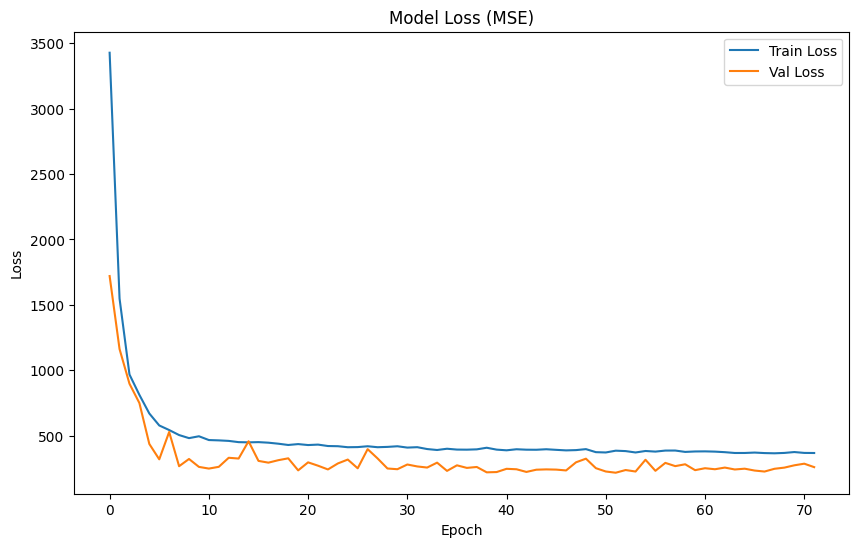
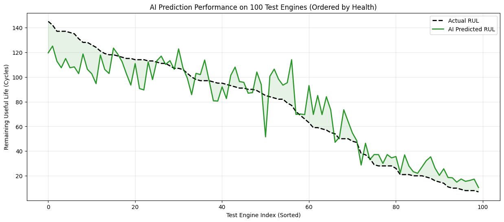
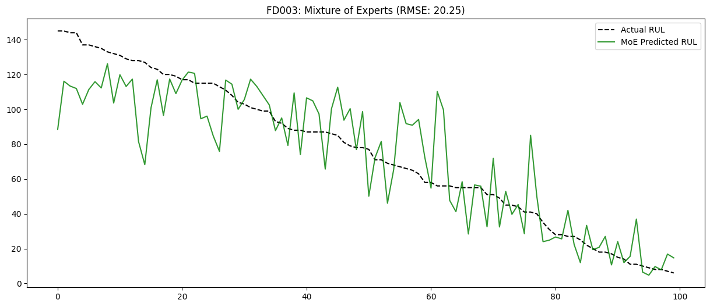

# Telemetry Dataset Module (TelementryData)

This module implements the telemetry side of the capstone using NASA CMAPSS-style engine run-to-failure data for RUL prediction.

## What This Module Contains

- Global attention-LSTM pipelines for:
  - `FD001`
  - `FD002`
  - `FD003`
  - `FD004`
- Fault-specific specialist pipelines for:
  - `FD003` (clustering + router + specialist models)
  - `FD004` (regime normalization + router + specialist models)
- Saved artifacts:
  - Model checkpoints (`.h5`, `.keras`)
  - Preprocessed train/test arrays (`.npy`)
  - Router/scaler objects (`.pkl`)

## Folder Structure

- `models/global_FD001/`
  - `01_Preprocessing.ipynb`
  - `02_Model_Training.ipynb`
  - `model_checkpoints/attention_lstm_fd001.h5`
- `models/global_FD002/`
  - `11_Preprocessing.ipynb`
  - `12_Model_Training.ipynb`
  - `model_checkpoints/attention_lstm_fd002.h5`
- `models/global_FD003/`
  - `21_Preprocessing.ipynb`
  - `22_model_training.ipynb`
  - `model_checkpoints/attention_lstm_fd003_global.h5`
- `models/global_FD004/`
  - `41_Preprocessing.ipynb`
  - `42_model_training.ipynb`
  - `model_checkpoints/global_fd004.keras`
- `models/fault_specific/FD003/`
  - `31_Fault_Clustering_Pre.ipynb`
  - `32_specialist0_model_training.ipynb`
  - `33_specialist1_model_training.ipynb`
  - `34_Final_Evaluation_Router.ipynb`
  - `fd003_moe_final_predictions.csv`
- `models/fault_specific/FD004/`
  - `51_fault_Preprocessing.ipynb`
  - `52_specialist0_training.ipynb`
  - `53_specialist1_training.ipynb`
  - `54_final_router.ipynb`
- `processed_data/`
  - Preprocessed tensors, labels, scalers, and router models used by training/evaluation notebooks.

## Recommended Execution Order

### Global Model Track

1. `FD001`: `01_Preprocessing.ipynb` -> `02_Model_Training.ipynb`
2. `FD002`: `11_Preprocessing.ipynb` -> `12_Model_Training.ipynb`
3. `FD003`: `21_Preprocessing.ipynb` -> `22_model_training.ipynb`
4. `FD004`: `41_Preprocessing.ipynb` -> `42_model_training.ipynb`

### Fault-Specific Track

1. `FD003`: `31` -> `32` -> `33` -> `34`
2. `FD004`: `51` -> `52` -> `53` -> `54`

## Modeling Notes

- Architecture: attention-enhanced LSTM regressors for RUL.
- Evaluation focus in notebooks includes prediction-vs-true curves and NASA-style scoring.
- Fault-specific pipelines use router logic to dispatch each sequence to the appropriate specialist model.

## Documented Experimental Outputs

The metrics below are extracted from `Documentation of PJT2 NASA.docx`.

| Dataset / Architecture | Reported Output |
|---|---|
| FD001 (Global Attention-LSTM) | RMSE: **14.6955**, NASA Score: **307.58**, Accuracy (±15): **66.00%** |
| FD002 (Global Attention-LSTM) | Test RMSE: **27.0426** |
| FD003 (Global Baseline) | Test RMSE: **21.04** |
| FD003 (MoE Final) | Test RMSE: **20.24** |
| FD003 Router Split | Specialist 0: **57 engines**, Specialist 1: **43 engines** |
| FD003 Specialist 0 (training) | MSE: **146.23** (internal RMSE ~**12.09**) |
| FD003 Specialist 1 (training) | MSE: **358.09** (internal RMSE ~**18.92**) |
| FD004 (Global Baseline) | Test RMSE: **40.56** |
| FD004 (Asymmetric MoE Final) | Test RMSE: **41.51** |
| FD004 Router Split | Specialist 0: **185 engines**, Specialist 1: **63 engines** |

## Graph Outputs from Notebooks

### FD001 Global Model

**Training convergence**

**Prediction tracking on test engines**

### FD003 Fault-Specific Modeling

**Unsupervised fault discovery (K-Means + PCA)**

**Final FD003 MoE performance**

### FD004 Global vs MoE Context

**FD004 global baseline behavior**

**FD004 asymmetric MoE output**

## Dependencies

Main dependencies used in this module:

- `numpy`, `pandas`, `matplotlib`, `seaborn`
- `scikit-learn`
- `tensorflow` / `keras`
- `joblib`

## Reproducibility Notes

- Several notebooks use local paths like `D:\\PJT2\\CMAPSSData`.
- Update path variables at the top of each notebook before running in a new environment.
- Keep `processed_data/` and `model_checkpoints/` paths consistent across preprocessing and training notebooks.
